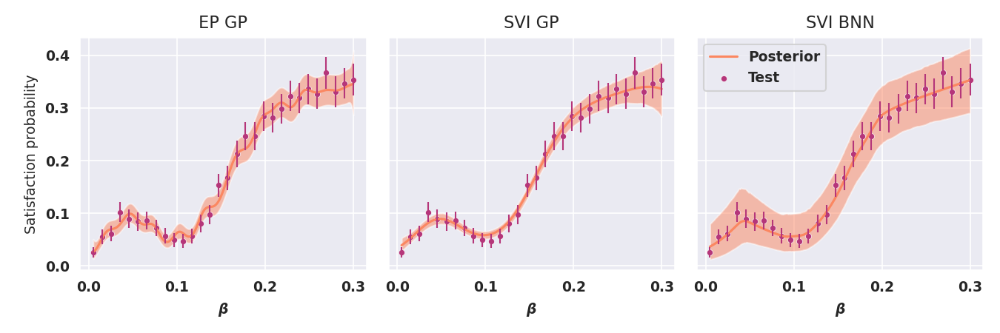
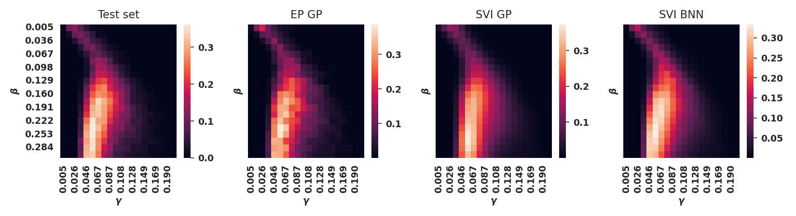
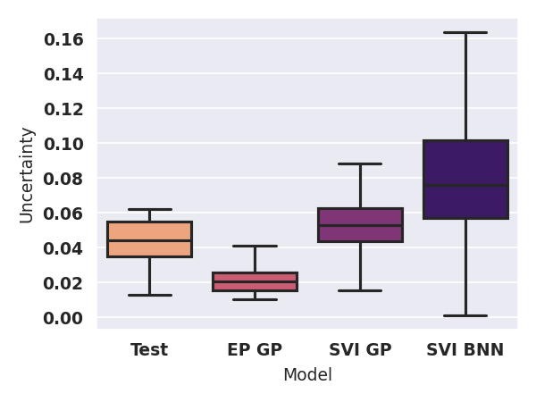

# Stochastic Variational Smoothed Model Checking

Luca Bortolussi, Francesca Cairoli, Ginevra Carbone, Paolo Pulcini (2022)

### Abstract
Model-checking for parametric stochastic models can be expressed as
checking the satisfaction probability of a certain property as a function of the parameters of the model. Smoothed model checking (smMC) leverages Gaussian Processes (GP) to infer the satisfaction function over the entire parameter space from a limited set of observations obtained via simulation. This approach provides accurate reconstructions with statistically sound quantification of the uncertainty. However, it inherits the scalability issues of GP. In this paper, we exploit recent advances in probabilistic machine learning to push this limitation forward, making Bayesian inference of smMC scalable to larger datasets, enabling its application to larger models in terms of the dimension of the parameter set. We propose Stochastic Variational Smoothed Model Checking (SV-smMC), a solution that exploits stochastic variational inference (SVI) to approximate the posterior distribution of the smMC problem. The strength and flexibility of SVI make SV-smMC applicable to two alternative probabilistic models: Gaussian Processes (GP) and Bayesian Neural Networks (BNN). Moreover, SVI makes inference easily parallelizable and it enables GPU acceleration. In this paper, we compare the performances of smMC against those of SV-smMC by looking at the scalability, the computational efficiency and at the accuracy of the reconstructed satisfaction function. 

## Project structure

- `Datasets/` contains the code to generate training and validation sets
    - `Models/` contains the specs of the CRN model and the config setting for the experiments
    - `Data_Generation/` generates dataset of pairs `(pameter, labels)` by generating CRN trajectories with respective STL boolean label. `labels` is a vector of length M of 0s and 1s, where M is the number of samples per parameter value.
    - `Data_Validation/` labels CRN trajectories wrt a STL requirement
    - `Data/WorkingDatasets` contains datasets and visualization plots
- `BNNs/` implements the Bayesian Neural Network model
- `GPs/` implements the Gaussian Process model

## Setup

Python version 3.7.6

Install virtual environment:
```
python -m venv venv
pip install -r requirements.txt
```

## Experiments

Activate the environment
```
source venv/bin/activate
```

### Download training and validation datasets

Download the available datasets in a folder `src/data/` from: https://mega.nz/folder/pbBFnYSJ#XXwzMHfJaV4G9xKx3NMIwg

Time needed to generate the data: https://www.dropbox.com/scl/fi/h3twljfitial1galoui9n/Datasets.paper?dl=0&rlkey=625cm5u25h1d4qqnwn1jbuw4g

To generate new datasets update the configuration files `src/Datasets/Data_Generation/*_config.py` and run `python efficient_data_gen.py` with the desired settings. 

### Case studies

`src/paths.py` contains the informations needed to perform training and evaluation on the several case studies.
Comment out the unwanted lines to exclude them from computations.

### Train and evaluate

Train and evaluate EP GP, SVI GP and SVI BNN models:
```
python EP_GPs/train_bnn.py
python SVI_GPs/train_gp.py
python SVI_BNNs/train_bnn.py
```

Plot final comparisons between the trained models and get summary statistics:
```
python plot_satisfaction.py
```



```
python plot_plot_uncertainty.py
```




Trained models are saved in `src/out/models/`, executions logs are saved in `src/out/logs/`, plots are saved in `src/out/plots/`, summary statistic are reported in `src/out/plots/evaluation_out.txt`.

To reproduce all plots from the paper simply run `./exec.sh`.
